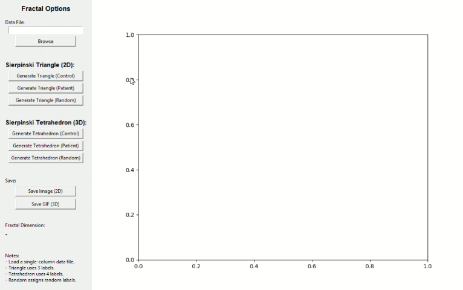

# FractalApp — Sierpinski Fractal Generator for HRV Time Series
**Author:** Alma Rocío Patiño Chávez  
**Version:** 1.0  

FractalApp is a graphical interface built in Python/Tkinter that generates 2D (Sierpinski Triangle) and 3D (Sierpinski Tetrahedron) fractal structures from one-dimensional time-series data, such as Heart Rate Variability (HRV).  
The app also calculates the fractal dimension using the box-counting algorithm and allows exporting images and GIF animations.

### Interface Preview

<p align="center">
  
</p>


---

## ✨ Features

- Load any single-column time-series file (`.txt`, `.csv`, `.dat`).
- Generate:
  - **Sierpinski Triangle (2D)**
  - **Sierpinski Tetrahedron (3D)**
- Three modes for point labeling:
  - **Control**
  - **Patient**
  - **Randomized**
- Compute **fractal dimension** (FD) using:
  - Box-counting estimator (2D and 3D)
- Export:
  - High-resolution PNG images
  - Animated 3D rotation GIFs
- Fully implemented using:
  - `tkinter`, `numpy`, `pandas`, `matplotlib`, `imageio`

---

## 📦 Installation

### **1. Clone this repository**
```bash
git clone https://github.com/emafriki/Fractal3D-HRV-Analyzer.git
cd Fractal3D-HRV-Analyzer
```

### **2. Create a virtual environment (recommended)**
```bash
python -m venv venv
source venv/bin/activate       # Linux / Mac
venv\Scripts\activate          # Windows
```

### **3. Install dependencies**
```bash
pip install -r requirements.txt
```

If you do not have a `requirements.txt`, you can create one with:

```bash
pip install numpy pandas matplotlib imageio
```

---

## ▶️ Running the Application

```bash
python fractal_app.py
```

---

## 🖥️ Creating a Windows Executable (optional)

Using **PyInstaller**:

```bash
pip install pyinstaller
pyinstaller --onefile --windowed Fractal3D-HRV-Analyzer.py
```

The executable will be created in the `dist/` folder.

---

## 🧪 Citation (Provisional)

If you use this software in a research article, please cite it as:

> Patiño-Chávez, A. R. (2025). *FractalApp: A Python Interface for Sierpiński-Based Fractal Analysis of Time-Series Data*. GitHub Repository.  
> URL: https://github.com/emafriki/fractal-HRV-Analayzer

**If your article is published**, update the citation to the final journal format.

---

## 📄 License

You can choose any license, but recommended:

- **MIT License** (free for academic and commercial use)  
- **GPL-3.0** (ensures derivative works remain open source)

Example MIT license:

```
MIT License © 2025 Alma Rocío Patiño Chávez
```

---

## 📬 Contact

For questions or collaborations, contact:  
**pa401981@uaeh.com** 

---

## ❤️ Acknowledgements

This tool was developed as part of the research project:

**“Exploring the fractal complexity of cardiac variability in Epilepsy”**

Please cite both the article (when published) and this repository when using the app in academic work.

---

